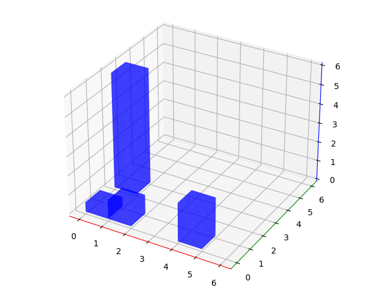
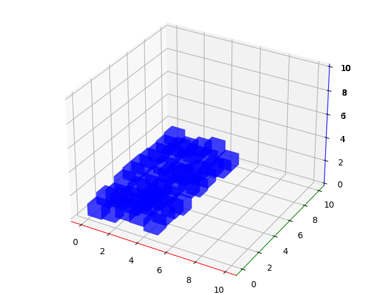

# ancients_altar
Make multiple blocks of different height in a 2D plane, in a 3D space

For example, some different heights and different positions

or a plane of equal-sized cubes with a varying height

Can output 3d-printable STLs (confirmed slicing works in Cura 4.9 - results in valid toolpaths & infill)

Depends on: python3, numpy, matplotlib, numpy-stl
